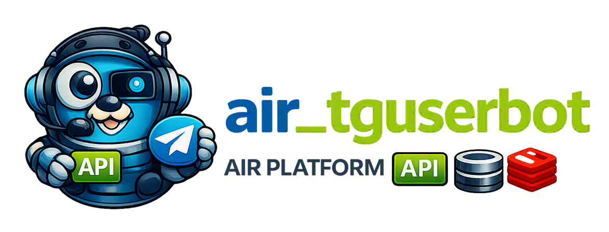

# AiR Telegram UserBot



[🇷🇺 Русская версия](README.ru.md)


[](https://t.me/marusia_dev)

`air_tguserbot` is an AiR platform service for Telegram UserBots. It manages user Telegram sessions and provides an HTTP/WebSocket API, as well as a separate gRPC API for voice calls.

## Important note
The project has been partially migrated to `purego`, but it is not yet a fully self-contained
`pure-Go` application.

What has already been done:

- the main Go binary is built with `CGO_ENABLED=0`;
- voice-call library functions are called through
  [ebitengine/purego](https://github.com/ebitengine/purego), without a direct `import "C"`;
- the library is loaded at runtime through `dlopen`/`dlsym`.

What is not implemented yet:

- there is no pure-Go implementation of the audio stack and WebRTC/Telegram voice calls;
- voice calls use `slim_libntgcalls.so`, a precompiled C/C++ `ntgcalls` library;
- this library requires glibc, `libgcc`, `libstdc++`, and `libz`, so the application runs
  in a glibc-based image (`distroless/cc`) rather than a fully static `scratch`/musl environment;
- the `purego` adapter calls native functions using the Linux amd64 ABI and uses glibc's
  `calloc`/`free` to pass buffers compatible with the native library;
- voice-call code is currently built only for `linux/amd64` (`//go:build amd64 && linux`).

In other words, `purego` removes the CGO dependency from the Go-code build process, but it
does not replace the native library itself. The regular UserBot features (HTTP, WebSocket,
gRPC, Telegram API, MySQL, and Redis) work without a direct CGO dependency; the limitation
primarily concerns voice calls. Running this functionality requires the `slim_libntgcalls.so`
file shipped with the project and a glibc-compatible environment.

A complete pure-Go implementation of the project is possible. If you have the time and
interest to help with this effort, your contribution would be greatly appreciated.

## Features

- connecting and managing Telegram UserBots;
- starting, stopping, and restarting a user bot;
- retrieving the bot name and checking service availability;
- WebSocket connection for authentication and message exchange;
- streaming contacts through WebSocket;
- outgoing voice calls through Telegram;
- server-streaming call events: transcription, AI response, errors, and termination;
- state and configuration storage in MariaDB/MySQL;
- restoring interaction state through Redis;
- Prometheus metrics.

## Architecture

```text
air_tguserbot
├── HTTP :8080
│   ├── /tguser/available
│   ├── /tguser/getname
│   ├── /tguser/enable
│   ├── /tguser/disable
│   ├── /tguser/restart
│   ├── /tguser/ws
│   ├── /tguser/contacts/ws
│   ├── /tguser/call/hangup
│   └── /metrics
└── gRPC :9090
    └── calls.v1.Calls
        ├── StartOutgoingCall
        ├── SubscribeCallEvents
        └── HangupCall
```

The service receives Telegram UserBot configuration from `air_orchestrator` over gRPC. MariaDB/MySQL and, optionally, Redis are also used.

## HTTP API

The complete route description is available in the [OpenAPI specification](doc/openapi.yaml).

All routes that operate on a user bot require the `uid` query parameter:

```text
GET /tguser/getname?uid=42
```

Main routes:

| Method | Path | Purpose |
|---|---|---|
| GET | `/tguser/available` | Check availability |
| GET | `/tguser/getname?uid=...` | Get the bot name |
| GET | `/tguser/enable?uid=...` | Start the bot |
| GET | `/tguser/disable?uid=...` | Stop the bot |
| GET | `/tguser/restart?uid=...` | Restart the bot |
| GET | `/tguser/ws?uid=...` | WebSocket authentication and messaging |
| GET | `/tguser/contacts/ws?uid=...` | WebSocket contacts stream |
| POST | `/tguser/call/hangup?userId=...&callId=...` | Hang up an active call |
| GET | `/metrics` | Prometheus metrics |

WebSocket routes require the `Upgrade: websocket` header. If `uid` is missing, the server returns `400` with a JSON error.

## gRPC Call API

The gRPC server listens on `:9090` and implements the `calls.v1.Calls` service. Inside Docker, the service address is `tguserbot_app:9090`; locally, it is `127.0.0.1:9090`.

Contract: [calls.proto](internal/delivery/rpc/calls.proto).

Typical flow:

```text
StartOutgoingCall
        ↓ call_id
SubscribeCallEvents
        ↓ real-time events
HangupCall (if needed)
        ↓
CALL_ENDED
```

`StartOutgoingCall` accepts `user_id`, `provider`, and `target`, starts a call, and returns `call_id`. `SubscribeCallEvents` supports `after_sequence` to resume the stream after reconnecting. Audio is not transmitted over gRPC; it is processed inside the Telegram service.

## Requirements

- Go 1.25 or newer;
- MariaDB/MySQL;
- Redis — optional, but recommended for restoring state;
- gRPC access to `air_orchestrator`;
- a service key in the `.service_key` file.

## Configuration

Main environment variables:

| Variable | Purpose |
|---|---|
| `DB_HOST` | MariaDB/MySQL address |
| `DB_NAME` | Database name |
| `DB_USER` | Database user |
| `DB_PASSWORD` | Database password |
| `REDIS_ADDR` | Redis address; may be empty |
| `REDIS_PASSWORD` | Redis password |
| `REDIS_DB` | Redis database number |
| `GRPC_CONFIG_HOST` | `air_orchestrator` gRPC address |
| `SERVICE_KEY_FILE` | Path to the service key |
| `REAL_URL` | Public service domain |
| `LOG_LEVEL` | Logging level |
| `GLOB_USER_MODEL_TTL` | User model TTL in minutes |

Development and production values are specified in [dev.yml](dev.yml) and [prod.yml](prod.yml). Do not add secrets to the repository.

## Running

Run the application locally:

```bash
go run ./cmd
```

Run with Docker Compose:

```bash
docker compose -f dev.yml up -d --build
```

Production uses `prod.yml`:

```bash
docker compose -f prod.yml up -d --build
```

Before starting, the external networks specified in the Compose files must exist:

```bash
docker network create air_shared
docker network create monitoring_shared
```

## Development

Check formatting and run tests:

```bash
gofmt -w ./cmd ./internal
go test ./...
```

## Related projects

- [air_orchestrator](https://github.com/ikermy/air_orchestrator) — AiR service configuration and coordination;
- [air-common](https://github.com/ikermy/air-common) — shared models, realtime providers, and infrastructure components;
- [air-logger](https://github.com/ikermy/air-logger) — logging;
- [air_front](https://github.com/ikermy/air_front) — AiR platform user interface.

## License

This project is distributed under the [MIT](LICENSE) license. It may be freely used, copied, modified, and distributed, provided that the license text and copyright notice are preserved.

The full license text is available in the [`LICENSE`](LICENSE) file.

## Contacts

[](https://t.me/ikermy)
